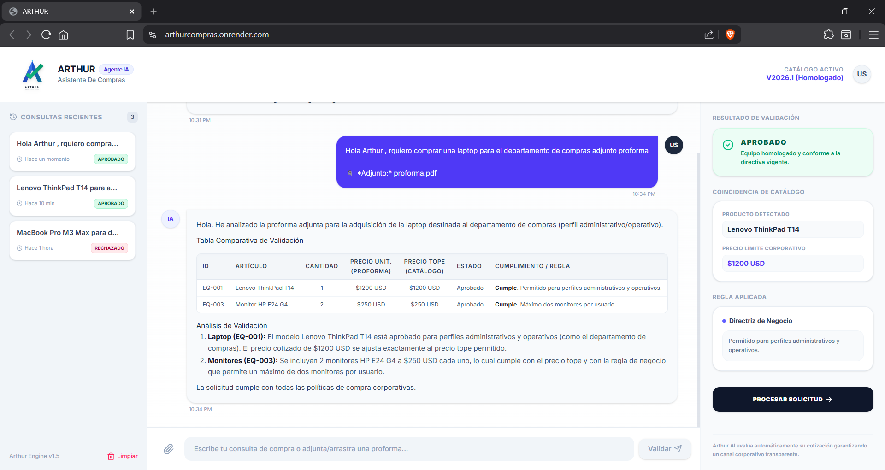
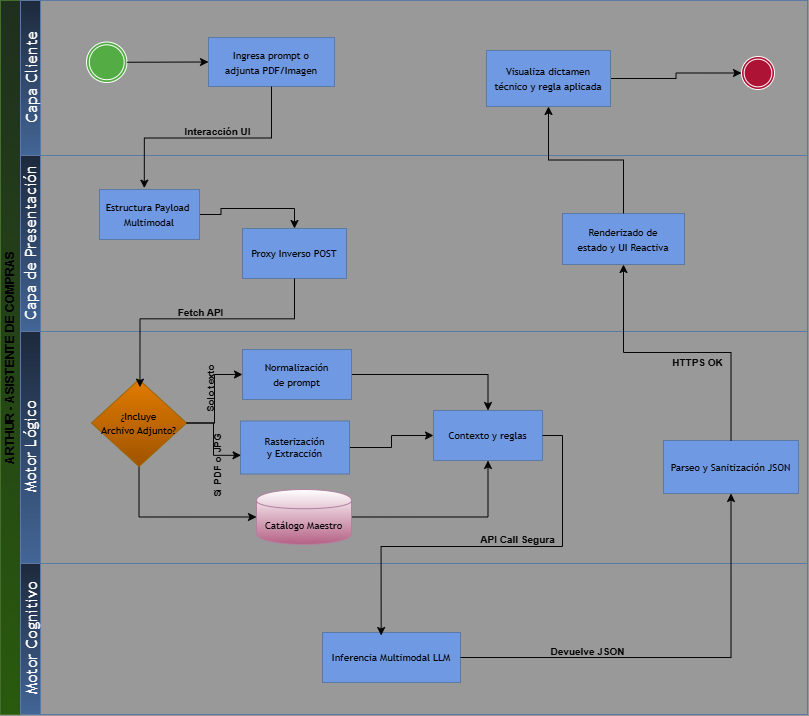

# ⚡ Arthur — Sistema Entrenado para Homologación de Compras Corporativas


## Descripción General del Proyecto

Este proyecto implementa a **Arthur** , un agente de inteligencia artificial diseñado para automatizar y agilizar la validación de solicitudes de compra corporativa. 

El sistema actúa como una primera línea de defensa que procesa solicitudes de usuarios finales —mediante lenguaje natural o extracción documental— y las audita contra un catálogo maestro de hardware homologado. Al centralizar y estandarizar la evaluación, Arthur reduce drásticamente el tiempo de procesamiento operativo (SLA), asegura el cumplimiento estricto de las directrices presupuestarias y elimina el sesgo humano en la validación técnica de activos tecnológicos.

---

## Evidencia de Funcionamiento

https://arthurcompras.onrender.com/ 

### Interfaz y Validación Multimodal



---

## Arquitectura de la Solución

El proyecto implementa una **arquitectura web desacoplada (SPA + API REST)** optimizada para despliegues en la nube, garantizando alta disponibilidad, seguridad y separación de responsabilidades. El flujo de datos está diseñado para aislar el frontend del cliente mediante un backend orquestador (Node.js/Express) que sirve la interfaz estática y actúa como proxy inverso hacia el motor analítico transaccional desarrollado en Python (FastAPI).



---

## 3. Stack Tecnológico

La solución está construida sobre tecnologías modernas para asegurar rendimiento y mantenibilidad:

*   **Frontend (Capa de Presentación):** Interfaz SPA construida con React 19, empaquetada ultrarrápida con Vite, y estilizada utilizando Tailwind CSS.
*   **Orquestador (Proxy):** Servidor Node.js con Express, encargado de servir la UI en producción y manejar el proxying seguro para evitar exponer el motor lógico al cliente.
*   **Backend (Motor Analítico):** API REST transaccional desarrollada en Python utilizando FastAPI y Uvicorn.
*   **Motor Cognitivo (IA):** Integración con `langchain-google-genai` para el enrutamiento de prompts e inferencia multimodal (Visión + Semántica) a través del modelo **Google Gemini 3.5 Flash**.
*   **Procesamiento Documental:** Extracción de datos y rasterización de PDFs a alta resolución gestionada por PyMuPDF (`fitz`).

---

## Requisitos Previos

Asegúrate de contar con las siguientes herramientas en tu entorno local antes de instalar el proyecto:

*   [Node.js](https://nodejs.org/) (v18.x o superior) y gestor de paquetes (`npm`, `yarn` o `pnpm`).
*   [Python](https://www.python.org/) (v3.10 o superior).
*   Una clave de API activa de [Google AI Studio (Gemini)](https://aistudio.google.com/app/apikey).

---

## Configuración y Variables de Entorno

El sistema requiere configuraciones específicas para enlazar los servicios de Inteligencia Artificial.

1. Navega al directorio del backend (`/backend`).
2. Crea un archivo `.env` o `.env.development` en la raíz de ese directorio.
3. Configura tu token de acceso de Google:
   ```env
   GEMINI_API_KEY=tu_clave_api_aqui
   ```
4. **Catálogo de Compras:** Asegúrate de que el archivo base de datos `catalogo_compras.csv` se encuentre en el mismo directorio que el archivo `main.py`. Este archivo sirve como la única fuente de verdad para el agente cognitivo.

---

## Ejecución del Entorno de Desarrollo

La arquitectura está diseñada para orquestarse desde un único script principal en Node.js que levanta todos los procesos necesarios en paralelo.

1. Instala las dependencias de Node.js en la raíz del frontend:
   ```bash
   npm install
   ```
2. Instala las dependencias de Python (preferiblemente en un entorno virtual `.venv`):
   ```bash
   pip install -r backend/requirements.txt
   ```
3. Inicia el ecosistema completo:
   ```bash
   npm run dev
   # o utilizando el script directo:
   npx ts-node server.ts
   ```

**¿Qué sucede internamente?**
*   El script iniciará el entorno Vite como *middleware* (si estás en desarrollo).
*   Se lanzará un subproceso (`spawn`) que ejecutará Uvicorn para el backend de Python en `http://127.0.0.1:8000`.
*   El servidor Node.js/Express quedará escuchando peticiones en `http://localhost:3000` funcionando como puente seguro entre el cliente y el motor IA.

---

## Despliegue en la Nube (Producción)

Debido a que el servidor de Node.js se encarga de levantar el subproceso de Python (`child_process.spawn`), la estrategia ideal para desplegar esta aplicación en plataformas como **Render** o **Railway** es mediante un contenedor Docker que incluya ambos entornos (Node.js y Python).


```

## Estructura Principal del Proyecto

📦 arthur-compras
 ┣ 📂 backend/                 # ⚙️ Motor Analítico (FastAPI)
 ┃ ┣ 📜 catalogo_compras.csv   # Base de datos de equipos homologados
 ┃ ┣ 📜 main.py                # Core y Prompt System
 ┃ ┗ 📜 requirements.txt       # Dependencias de Python
 ┣ 📂 frontend/                # 🖥️ Interfaz de Usuario y Proxy
 ┃ ┣ 📂 src/                   # Código fuente de React
 ┃ ┣ 📜 index.html             # Plantilla base Vite
 ┃ ┣ 📜 package.json           # Dependencias de Node.js
 ┃ ┗ 📜 server.ts              # Proxy inverso Express y orquestador
 ┣ 📜 Dockerfile               # Configuración de contenedor para producción
 ┗ 📜 README.md                # Documentación principal
```

---

## Ejemplos de Interacción

* **Validación por Texto:** 
  * **Usuario:** "Necesito comprar una MacBook Pro M3 Max para mi equipo."
  * **Arthur:** Analizará el catálogo y rechazará la solicitud por ser un modelo "No Homologado", generando la tabla Markdown comparativa.
* **Validación Multimodal (Visión AI):** 
  * **Usuario:** Sube una captura de pantalla (.JPG) o un .PDF de una proforma o bien del carrito de compras de una tienda online.
  * **Arthur:** Procesará visualmente la imagen, descartará la publicidad o botones irrelevantes, extraerá la marca, modelo y precio, y cruzará esos datos contra el precio tope establecido en el archivo de reglas corporativas.

